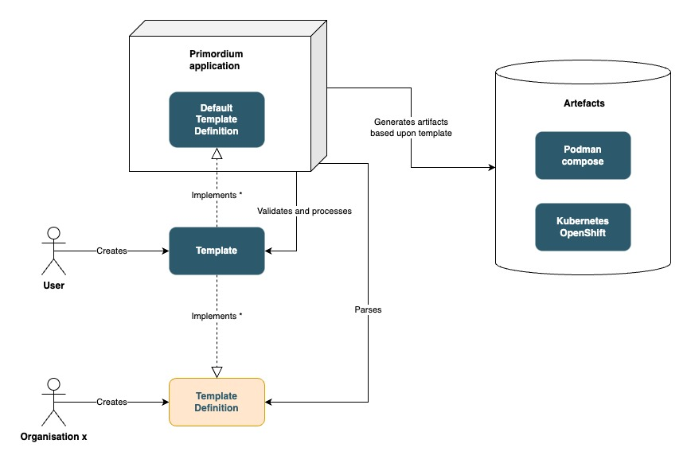

# Primordium
Primordium is an application that counts as a wrapper layer around different deployment tooling
(e.g., Helm, Kubernetes/OpenShift manifests/Podman compose/Docker compose/...). As all these different tooling
come with their own learning curve, complexity and overhead (i.e., you don't need to configure all the fields 
to deploy a specific application), we thought that there was a need for a simplified abstraction on top of these
deployment models/tooling.

## Introduction

### Biological meaning
Primordium is a term that originated from the field of embryology and refers to the early stages of development in an organism, specifically the initial undifferentiated cells or mass of cells from which more complex structures and
tissues will eventually form.

During the primordial stage, these cells undergo rapid growth and differentiation under the influence of various signaling molecules and genetic instructions. The process of cellular differentiation leads to the formation of distinct
tissues and organs that make up the developing organism.

Primordium can also be used more broadly to describe an early stage or origin of something, not just in biology but also in other fields such as cosmology, where the primordial universe refers to the initial state of the universe before
the formation of galaxies and stars. In this context, it describes the earliest stages of the universe's expansion and cooling after the Big Bang.

### Technical description
In our deployment model for an application(e.g., Helm, Kubernetes/OpenShift manifests/Podman compose/Docker compose/...), Primordium represents the foundational stage of our tool. 
This name was selected because it signifies the early and simple phase in the application's lifecycle. With Primordium, you will have
access to a streamlined template without encountering the added complexities that come with utilizing complex tools such as Helm or Kubernetes artifact descriptions. 
Instead, these descriptions will be generated automatically by Primordium.

## Documentation

### Project outline
As visualised in the following image, the Primordium project consists of three main components, being 
the template definition, the template and the artefacts.

| Component           | Description                                                                                                                                                                                                                                                                                                                                                          |
|---------------------|----------------------------------------------------------------------------------------------------------------------------------------------------------------------------------------------------------------------------------------------------------------------------------------------------------------------------------------------------------------------|
| Template Definition | The listing of the fields that can be used in the template, indicating which fields are required, defining the structure of the template, .... This definition can be externalized and be created by an organisation or user. By default there is a template definition available in the Primordium project: `primordium default-template-definition --directory=.`. |
| Template            | The template implementing the given template definition. This is an abstraction layer on top of deployment models for an application(e.g., Helm, Kubernetes/OpenShift manifests/Podman compose/Docker compose/...).                                                                                                                                                  |
| Artefacts           | Deployment model(s) manifest(s) for an application(e.g., Helm, Kubernetes/OpenShift manifests/Podman compose/Docker compose/...), generated upon the defined template. Now the user doesn't need to think about different deployment solutions, he/she just has to provide the main content, required to have a successful deploy on x different platforms.          |



### Build the project
It is fairly easy to build the project as it is a [clean architecture](https://github.com/maarten-vandeperre/clean-architecture-software-sample-project) based Quarkus - Gradle application:
* Build the project:  
    ```shell
    ./gradlew clean build
    ```
* Build the uber/fat-jar:
    ```shell
    ./gradlew clean build -Dquarkus.package.type=uber-jar 
    ```
* Run the uber/fat-jar:
    ```shell
    java -jar ./application/configuration/quarkus-cli/build/quarkus-cli-0.0.1-SNAPSHOT-runner.jar --help 
    ```
* Run in DEV mode:
    ```shell
    ./gradlew :application:configuration:quarkus-cli:quarkusDev --quarkus-args='--help' 
    ```

### Use Primordium/Releases
No release yet as we are still in incubating phase

### Example
No full-fetched example yet as we are still in incubating phase

## WIP features

* Add default values for non-required fields (in the template definition YAML file).
* Add other values types than String.
* Add functionality to generate a prefilled YAML template for a given template definition.
* Allow (i.e., mainly test) externalized template definitions.